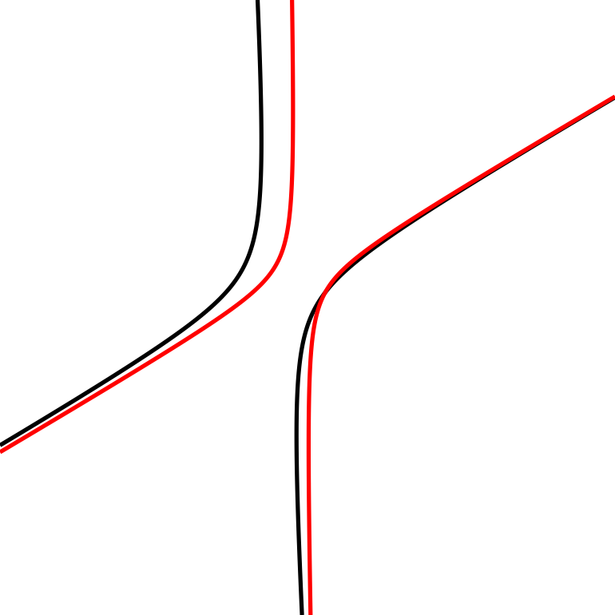
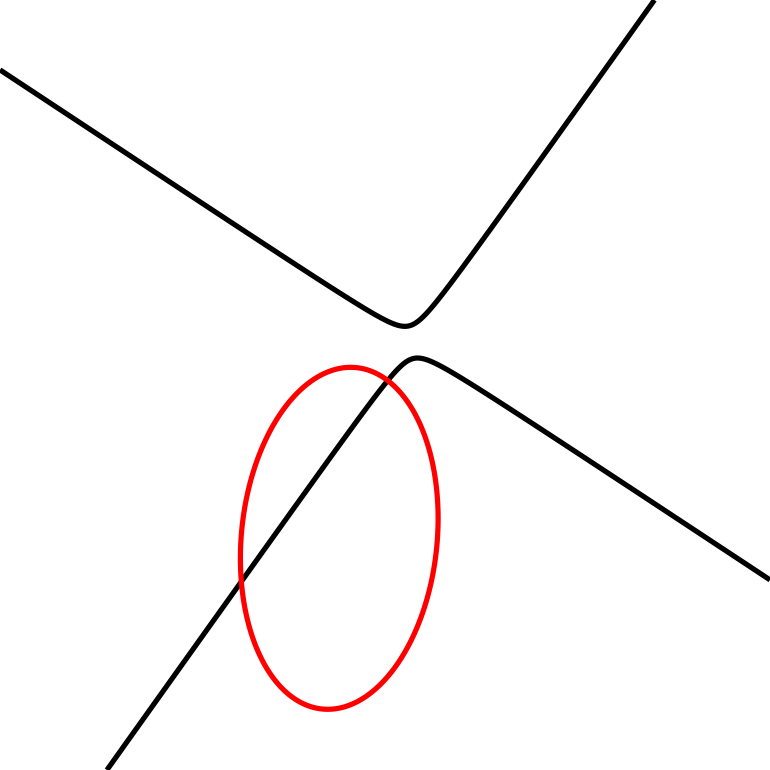

# Quadratic Curve Recovery – Coefficient Loss

This experiment investigates whether a convolutional neural network can recover the coefficients of a quadratic implicit curve directly from its rendered image.

The target equation has the form:

ax² + bxy + cy² + dx + ey + f = 0

---

## Dataset Generation

Synthetic data is generated as follows:

- Random quadratic coefficients sampled from uniform distributions
- Degenerate quadratic parts rejected
- L2 normalization applied to remove scale ambiguity
- Only curves that genuinely intersect the evaluation grid are retained
- Curves rendered as contour plots (224×224 RGB images)

Each sample consists of:
- A curve image
- Its corresponding normalized coefficient vector (a, b, c, d, e, f)

---

## Model Architecture

The model is a convolutional neural network:

- 5 convolutional blocks (Conv → Conv → MaxPool)
- Global Average Pooling
- Dense regression head (6 outputs)

The network directly regresses the six normalized coefficients.

---

## Loss Function

To handle sign ambiguity in implicit equations, a sign-invariant MSE loss is used:

L = min( ||θ - θ̂||² , ||θ + θ̂||² )

This accounts for the equivalence:

θ ≡ -θ

All coefficient vectors are normalized to unit L2 norm to eliminate scale ambiguity.

---

## Training Setup

- Optimizer: Adam (1e-4)
- Early stopping on validation loss
- Train/validation split: 80/20
- Dataset size: 5000 synthetic samples

---

## Evaluation

Evaluation is performed on 100 newly generated random curves:

- Predictions are sign-aligned with ground truth
- L2 coefficient error is measured
- Worst-case examples are visualized

Typical behavior:

- High geometric fidelity for most curves
- Occasional failure when discriminant sign is mispredicted
  (ellipse vs hyperbola type confusion)

---

## Observations

Strengths:

- Stable training
- Strong recovery of conic structure
- Good generalization to unseen synthetic curves

Limitations:

- Coefficient-space loss does not directly enforce geometric similarity
- Curve type can occasionally be misclassified
- Discriminant is not explicitly constrained

---

## Research Direction

This experiment serves as a baseline for comparison with:

- Geometric loss formulations
- Hybrid loss approaches
- Higher-degree curve recovery (cubic, quartic, etc.)

The goal is not to produce a final model, but to provide a controlled baseline for structured comparison.

## Example Results

### Successful Recovery

Ground truth (black) vs predicted curve (red):

---

### Failure Case (Type Confusion)

Example where discriminant sign is mispredicted:

